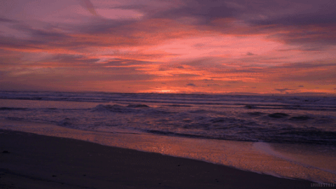

## Hello 👋
I am a United States based data-driven strategist with over 2 years of experience working with data to drive insights and solutions and having 6 years of research experience in the Application of Data Science, Machine Learning & AI in the Oceanography & Earth Sciences sphere. Passionate about translating numbers and patterns into actionable strategies through compelling narratives. Excited to apply this diverse data skillset to new analytics challenges that deliver value. My expertise spans across data analysis, machine learning, deep learning, and statistical analysis, backed by hands-on experience with various programming languages and development tools.

 ### 🏫 Education
- *Master of Science - Information Systems*, ***University of Maryland Baltimore County*** (Aug 2023 - May 2025)
- *Summer School Student - ***Data Science* - Hertie School of Data Science*** (June 2022 - July 2022)
- *Summer School Studen* - ***Turin School of Regulation - Regulation of Local Public Services*** (2021)
- *Bachelor of Engineering - Information Technology*, ***University of Mumbai*** (Aug 2019 - May 2023)

### 🏢 Experience
[View my Experience](https://github.com/SomitaChaudhari/SomitaChaudhari/blob/main/Experience.md)

### 🎯  Skills 
- ***Languages***: Python, R, HTML, CSS, JavaScript.
- ***Databases***: SQL, MySQL, PostgreSQL, PL/SQL.
- ***Libraries***: Pandas, NumPy, Matplotlib, SciPy, seaborn, scikit-learn, PyTorch, TensorFlow, Keras.
- ***Data Analysis Tools***: Tableau, Microsoft PowerBI, Microsoft Excel.
- ***ML Algorithms***: Classification, Clustering, Regression, Random Forest, Apriori, Time Series Forecasting, KNN, Decision Tree, XGBoost. 
- ***DL Algorithms***: CNN, RNN, LSTM, BERT, Transformers.
- ***Statistical Analysis***: Hypothesis Testing, A/B Testing, ANOVA, Descriptive/Predictive Analytics.
- ***Development Tools***: AWS (SageMaker, Lambda, S3, EC2, ECS, S3, Glue, RDS, Redshift), Microsoft Azure, Google Cloud Platform, Hadoop, Spark, Hive.
- ***OCEANS***: argopy, cmocean, xarray, pyleoclim.

### 🏆 Awards, Research Projects, Conference Participation & Professional Memberships 
[View](https://github.com/SomitaChaudhari/SomitaChaudhari/blob/main/Research%20Projects.md)

  
